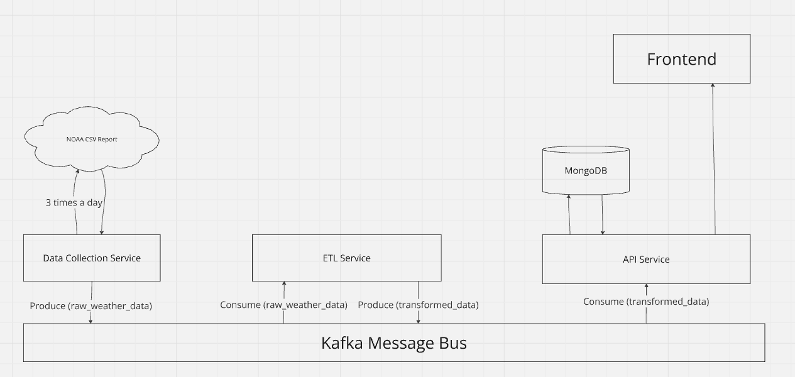

# Weather Data System



## Overview

The **Weather Data System** is a microservices-based architecture designed to collect, transform, store, and serve weather data. It consists of three main services:
1. **Data Collection Service**: Fetches raw weather data in CSV format from NOAA, processes it, and publishes it to Kafka.
2. **ETL Service**: Consumes raw weather data from Kafka, transforms it, and publishes it to Kafka.
3. **API Service**: Stores transformed data to MongoDB and exposes a REST API for querying weather data stored in MongoDB by date, state, or both.

The system leverages **Kafka** for inter-service communication and **MongoDB** for storing transformed data.

---

## Running the Project

### Prerequisites

Ensure you have the following installed on your system:
- **Docker** (for containerizing and running services)
- **Node.js** (for the Data Collection and API services)
- **Go** (for the ETL service)
- **Kafka** (Message queue)
- **MongoDB** (NoSQL database)

### Run the docker containers
```bash
docker compose up --build
```
You can see the API service is running on port 3000.

## Example API Requests:
1. Fetch all data:
```bash
curl -X GET http://localhost:3000/api/wind
```
2. Fetch data by date:
```bash
curl -X GET "http://localhost:3000/api/wind?date=2024-09-19"
```
3. Fetch data by location:
```bash
curl -X GET "http://localhost:3000/api/wind?location=Florida"
```
4. Fetch data by date and location:
```bash
curl -X GET "http://localhost:3000/api/wind?date=2024-09-19&location=Florida"
```
